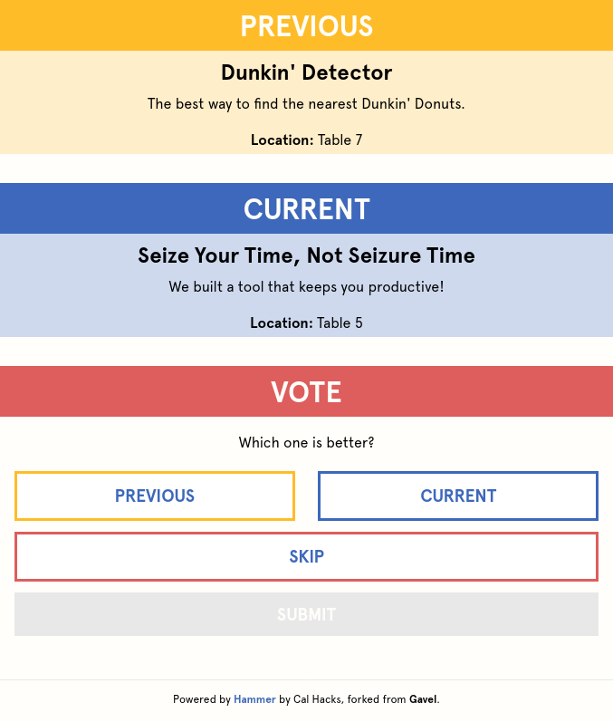
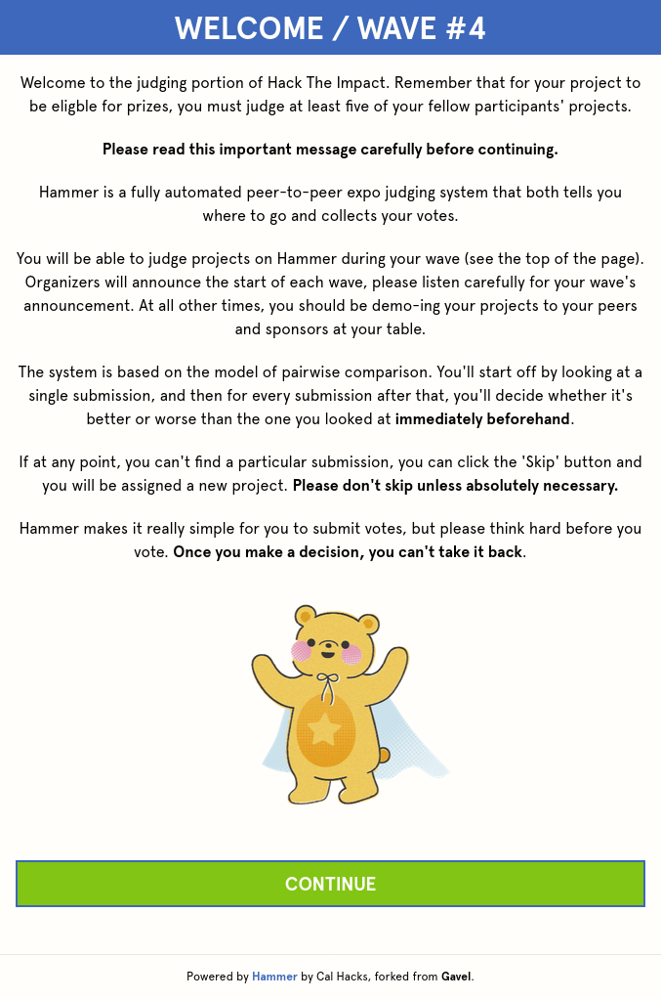
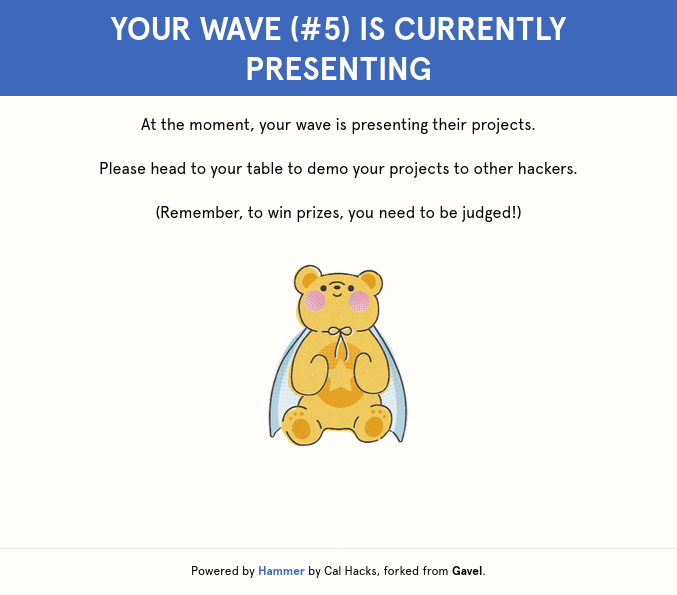

# 🧑‍⚖️ `hammer`

  

Peer-to-peer pairwise judging, forked from HackMIT's [Gavel](https://github.com/anishathalye/gavel).

If you're interested in using this at your event, please contact [`sampoder@calhacks.io`](mailto:sampoder@calhacks.io). General development instructions can be found in [DEVELOPMENT.md](/DEVELOPMENT.md).

We recommend referring to [Gavel's documentation](https://github.com/anishathalye/gavel/blob/master/README.md) for deployment and usage instructions.

## License

Released under AGPLv3. See [LICENSE.txt](LICENSE.txt) for details.